**Algoritma dan Struktur Data 2021-2022** 

**Nama : Andhito Galih Nur Cahyo**

**Kelas : 1F**

**No absen : 06**

**Nim : 2141720138**

**JOBSHEET IX**

**Linked List**

## **1. Tujuan Praktikum**  

Setelah melakukan materi praktikum ini, mahasiswa mampu: 

1. Membuat struktur data linked list 
2. Membuat linked list pada program 
3. Membedakan permasalahan apa yang dapat diselesaikan menggunakan linked list 

## **2. Praktikum** 

### **2.1 Pembuatan Single Linked List** 

### **2.1.1 Verifikasi Hasil Percobaan** 

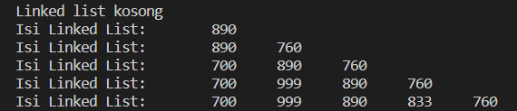

### **2.1.2 Pertanyaan**

1. Mengapa hasil compile kode program di baris pertama menghasilkan “Linked List Kosong”? 

2. Pada step 10, jelaskan kegunaan kode berikut 

    ```
     ndInput.next = temp.next;
     temp.next = ndInput;
    ```

3. Perhatikan class **SingleLinkedList**, pada method **insertAt** Jelaskan kegunaan kode berikut  

    ```
    if(temp.next.next == null) tail = temp.next;
    ```

**Jawaban :** 
1. Karena eksekusi awal langsung mencetak isi dari linked list yang mana linked listnya berada di dalam kondisi antrian atau listnya sedang kosong atau tidak memiliki data.

2. - Baris pertama merupakan Node baru yang mana merujuk pada alamat memori dari node setelah key
   - Baris kedua ialah pointer temp menyimpan alamat memori ndInput

3. Digunakan untuk kondisi jika temp.next.next (temp dari setelah temp) sama dengan null, maka tail sama dengan temp.next

## **2.2 Modifikasi Elemen pada Single Linked List** 

### **2.2.1 Langkah-langkah Percobaan**

### **2.2.2 Verifikasi Hasil Percobaan**

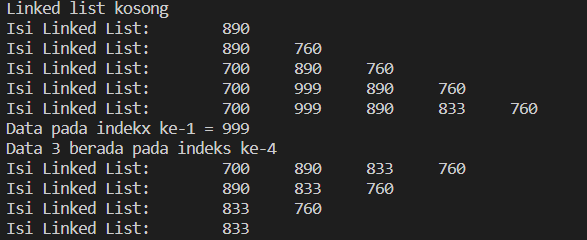

### **2.2.3 Pertanyaan**

1. Mengapa digunakan keyword break pada fungsi remove? Jelaskan! 

2. Jelaskan kegunaan kode dibawah pada method remove 

    ```
    }else if(temp.next.data == key){
        temp.next = temp.next.next;
    ```

3. Apa saja nilai kembalian yang dapat dikembalikan pada method indexOf? Jelaskan maksud masing-masing kembalian tersebut!

**Jawaban :** 
1. Karena pada code tersebut merupakan sebuah perulangan yang mana pada kondisi tersebut jika salah salah satu dari dua kondisi yang telah ditentukan tersebut terpenuhi, maka sudah tidak perlu dilakukan perulangan lagi, maka dari itu diberikan keyword break agar tidak berulang.

2. Kondisi tersebut dieksekusi jika kondisi yang pertama tidak cocok. Jika data temp setelahnya (temp.next.data) sama dengan key (data yang dirujuk), maka temp.next berubah menjadi temp.next.next atau terjadi perubahan posisi pada node sebelumnya ke node setelahnya.

3. - Jika tmp == null, maka akan mengembalikan nilai -1 atau tidak terdapat dalam index (data kosong).
   - jika tidak, maka akan mengembalikan nilai dari index yang diinputkan

## **3. Tugas** 

1  Buat method insertBefore untuk menambahkan node sebelum keyword yang diinginkan

**Jawaban:**

- Code:
```
public void insertBefore(int key, int input){
        Node ndInput = new Node(input, null);
        Node temp = head;
        do{
            if((temp.data == key) && (temp == head)){
                this.addFirst(input);
                break;
            }else if (temp.next.data == key){
                ndInput.next = temp.next;
                temp.next = ndInput;
                break;
            }
            temp = temp.next;
        }while (temp != null);
    }

```

- Output:

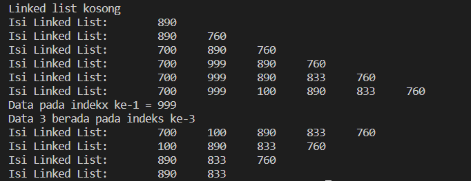

2  Implementasikan ilustrasi Linked List Berikut. Gunakan 4 macam penambahan data yang telah dipelajari sebelumnya untuk menginputkan data.

**Jawabam :**
- Code :
```
package Tugas;

public class ilustrasiLinkedList {
    char data;
    ilustrasiLinkedList next;

    public ilustrasiLinkedList(char data, ilustrasiLinkedList next){
        this.data = data;
        this.next = next;
    }
}

public class SLLT2 {
    ilustrasiLinkedList head;
        ilustrasiLinkedList tail;
    
        public boolean isEmpty(){
            return head == null;
        }
    
        public void print(){
            if(!isEmpty()){
                ilustrasiLinkedList tmp = head;
                System.out.print("Isi Linked List:\t");
                while (tmp != null){
                    System.out.print(tmp.data + "\t");
                    tmp = tmp.next;
                }
                System.out.println("");
            }else{
                System.out.println("Linked list kosong");
            }
        }
    
        public void addFirst(char input){
            ilustrasiLinkedList ndInput = new ilustrasiLinkedList(input, null);
            if(isEmpty()){
                head = ndInput;
                tail = ndInput;
            }else{
                ndInput.next = head;
                head = ndInput;
            }
        }
    
        public void addLast(char input){
            ilustrasiLinkedList ndInput = new ilustrasiLinkedList(input, null);
            if(isEmpty()){
                head = ndInput;
                tail = ndInput;
            }else{
                tail.next = ndInput;
                tail = ndInput;
            }
        }
    
        public void insertAfter(char key, char input){
            ilustrasiLinkedList ndInput = new ilustrasiLinkedList(input, null);
            ilustrasiLinkedList temp = head;
            do{
                if(temp.data == key){
                    ndInput.next = temp.next;
                    temp.next = ndInput;
                    if(ndInput.next == null) tail = ndInput;
                    break;
                }
                temp = temp.next;
            }while (temp != null);
        }
        
        public void insertBefore(char key, char input){
            ilustrasiLinkedList ndInput = new ilustrasiLinkedList(input, null);
            ilustrasiLinkedList temp = head;
            do{
                if((temp.data == key) && (temp == head)){
                    this.addFirst(input);
                    break;
                }else if (temp.next.data == key){
                    ndInput.next = temp.next;
                    temp.next = ndInput;
                    break;
                }
                temp = temp.next;
            }while (temp != null);
        }
        public void insertAt(int index, char input){
            if(index < 0){
                System.out.println("indeks salah");
            }else if(index == 0){
                addFirst(input);
            }else{
                ilustrasiLinkedList temp = head;
                for(int i=0; i<index-1; i++){
                    temp = temp.next;
                }
                temp.next = new ilustrasiLinkedList(input, temp.next);
                if(temp.next.next == null) tail = temp.next;
            }
        }
    }
public class T2SLLMain {
    public static void main(String[] args) {
        SLLT2 ilusSLL = new SLLT2();
        ilusSLL.print();
        ilusSLL.addFirst('b');
        ilusSLL.print();
        ilusSLL.addLast('d');
        ilusSLL.print();
        ilusSLL.insertAfter('d', 'e');
        ilusSLL.print();
        ilusSLL.insertBefore('d', 'c');
        ilusSLL.print();
        ilusSLL.insertAt(0, 'a');
        ilusSLL.print();
    }
}
```

- Output:

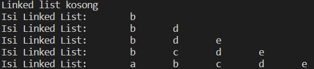

3.  Buatlah Implementasi Stack berikut menggunakan Single Linked List

**Jawaban :**

- Code:
```
package Tugas;

public class implementasiStack {
    String data;
    implementasiStack next;

    public implementasiStack(String data, implementasiStack next){
        this.data = data;
        this.next = next;
    }
}
public class SLLT3 {
    implementasiStack head;
    implementasiStack tail;
    
    public boolean isEmpty(){
        return head == null;
    }
    
    public void print(){
        if (!isEmpty()){
            implementasiStack tmp = head;
            System.out.println("");
            while (tmp != null){
                System.out.println(tmp.data);
                tmp = tmp.next;
            }
            System.out.println();
        }else{
            System.out.println("Stack Masih Kosong!");
        }
    }

    public void peek(){
        if(!isEmpty()){
            implementasiStack tmp = head;
            System.out.println("Isi Stack Teratas : " + tmp.data);
        }else{
            System.out.println("Stack Masing Kosong!");
        }
    }

    public void pushAwal(String input){
        implementasiStack ndInput = new implementasiStack(input, null);
        if(isEmpty()){
            head = ndInput;
            tail = ndInput;
        }else{
            ndInput.next = head;
            head = ndInput;
        }
    }
}

public class T3SLLMain {
    public static void main(String[] args) {
        SLLT3 sllStack = new SLLT3();
        sllStack.pushAwal("Bahasa");
        sllStack.print();
        sllStack.pushAwal("Android");
        sllStack.print();
        sllStack.pushAwal("Komputer");
        sllStack.print();
        sllStack.pushAwal("Basis Data");
        sllStack.print();
        sllStack.pushAwal("Matematika");
        sllStack.print();
        sllStack.pushAwal("Algoritma");
        sllStack.print();
        sllStack.pushAwal("Statistika");
        sllStack.print();
        sllStack.pushAwal("Multimedia");
        sllStack.print();

        System.out.println("Isi Stack: ");
        sllStack.print();
        sllStack.peek();
    }

```
- Output:

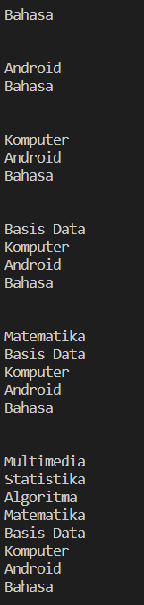

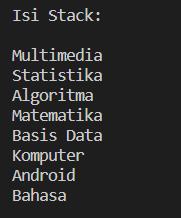

4.  Buatlah implementasi program antrian untuk mengilustasikan mahasiswa yang sedang meminta tanda tangan KRS pada dosen DPA di kampus pada tugas jobsheet 8 menggunakan LinkedList. Implementasikan Queue pada antrian mahasiswa dengan menggunakan konsep LinkedList! 

**Jawab:**

Implementasi program antrian untuk mengilustasikan mahasiswa yang sedang meminta tanda tangan KRS pada dosen DPA di kampus pada tugas jobsheet 8 menggunakan LinkedList

- Code:
```
package Tugas;

public class MhsT4 {
    String nim, nama;
    int absen;
    double ipk;
    MhsT4 next;

    MhsT4(String nim, String nama, int absen, double ipk, MhsT4 next){
        this.nim = nim;
        this.nama = nama;
        this.absen = absen;
        this.ipk = ipk;
        this.next = next;
    }
}

public class SLLMhsT4 {
    MhsT4 head;
    MhsT4 tail;

    public boolean IsEmpty(){
        return head == null;
    }

    public void print(){
        if(!IsEmpty()){
            MhsT4 tmp = head;
            int sort = 0;
            while(tmp != null){
                System.out.println("Mahasiswa ke-" + sort + " : " + tmp.nim + " " + 
                tmp.nama + " " + tmp.absen + " " + tmp.ipk);
                tmp = tmp.next;
                sort++;
            }
        }else{
            System.out.println("Antrian Masih Kosong!");
        }
    }

    public void antrianTerdepan(){
        if(!IsEmpty()){
            MhsT4 tmp = head;
            System.out.println("Antrian paling depan: " + tmp.nim + " " + 
            tmp.nama + " " + tmp.absen + " " + tmp.ipk);
        }else{
            System.out.println("Antrian masing kosong!");
        }
    }

    public void antrianTerbelakang(){
        if(!IsEmpty()){
            MhsT4 tmp = head;
            while(tmp != null){
                if(tmp == tail){
                    System.out.println("Antrian paling belakang: " + tmp.nim + " " + 
                    tmp.nama + " " + tmp.absen + " " + tmp.ipk);
                }
                tmp = tmp.next;
            }
        }else{
            System.out.println("Antrian masih kosong!");
        }
    }

    public void addData(String nim, String nama, int absen, double ipk){
        MhsT4 ndInput = new MhsT4(nim, nama, absen, ipk, null);
        if(IsEmpty()){
            head = ndInput;
            tail = ndInput;
        }else{
            tail.next = ndInput;
            tail = ndInput;
        }
    }

    public void searchDataOfIndex(int index){
        if(IsEmpty()){
            System.out.println("Antrian masih kosong!");
        }else{
            MhsT4 tmp = head;
            for(int i=1; i<index; i++){
                tmp = tmp.next;
            }
            System.out.println("Data Mahasiswa dengan Nomor Antrian " + index + " : " + tmp.nim + " " + 
            tmp.nama + " " + tmp.absen + " " + tmp.ipk);
        }
    }

    public void searchDataOfNim(String key){
        MhsT4 tmp = head;
        int index = 0;
        while (tmp != null && (!(tmp.nim.equals(key)))){
            tmp = tmp.next;
            index++;
        }
        if(tmp == null){
            System.out.println("Antrian Kosong!");
        }else{
            System.out.println("Mahasiswa dengan NIM: " + key + " berada pada index ke - " + index);
        }
        System.out.println("Data Mahasiswa: " + tmp.nim + " " + 
        tmp.nama + " " + tmp.absen + " " + tmp.ipk);
    }

    public void remove(){
        if(IsEmpty()){
            System.out.println("Antrian Masih Kosong, tidak dapat dihapus!");
        }else if (head == tail){
            head = tail = null;
        }else{
            MhsT4 temp = head;
            while(temp.next != tail){
                temp = temp.next;
            }
            temp.next = null;
            tail = temp;
        }
    }
}

import java.util.Scanner;
public class T4MhsMain {
    public static void menu(){
        System.out.println("\nPilihan menu: ");
        System.out.println("1. Antrian baru");
        System.out.println("2. Antrian keluar");
        System.out.println("3. Cek Antrian paling depan");
        System.out.println("4. Cek Antrian Paling Belakang");
        System.out.println("5. Cek Semua Antrian");
        System.out.println("6. Cek Antrian Mahasiswa");
        System.out.println("7. Cetak Data Mahasiswa");
        System.out.println("8. Exit");
        System.out.println("---------------------------------------------------------------------");
    }   
    public static void main(String[] args) {
        SLLMhsT4 sllM = new SLLMhsT4();
        Scanner sc = new Scanner(System.in);
        Scanner input = new Scanner(System.in);

        int pilih;
        do{
            menu();
            System.out.print("Masukkan pilihan: ");
            pilih = sc.nextInt();
            sc.nextLine();
            switch(pilih){
                case 1:
                    System.out.print("\nNIM: ");
                    String nim = sc.nextLine();
                    System.out.print("Nama: ");
                    String nama = sc.nextLine();
                    System.out.print("Absen: ");
                    int absen = sc.nextInt();
                    System.out.print("IPK: ");
                    double ipk = sc.nextDouble();
                    sllM.addData(nim, nama, absen, ipk);
                    System.out.println("");
                    break;
                case 2:
                    sllM.remove();
                    System.out.println("");
                    break;
                case 3:
                    sllM.antrianTerdepan();
                    System.out.println("");
                    break;
                case 4:
                    sllM.antrianTerbelakang();
                    System.out.println("");
                    break;
                case 5:
                    sllM.print();
                    System.out.println("");
                    break;
                case 6:
                    System.out.print("Masukkan NIM : ");
                    String cari = input.nextLine();
                    sllM.searchDataOfNim(cari);
                    System.out.println("");
                    break;
                case 7:
                    System.out.print("Masukkan Nomor Antrian: ");
                    int index = sc.nextInt();
                    sllM.searchDataOfIndex(index);
                    break;
                case 8:
                    System.out.println("TERIMA KASIH....");
                    System.exit(0);
                    break;
            }
        } while (pilih > 0 && pilih < 9);
        System.out.println("TERIMA KASIH...");
    }
}

```
- Output:

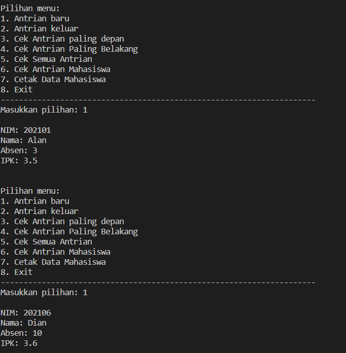

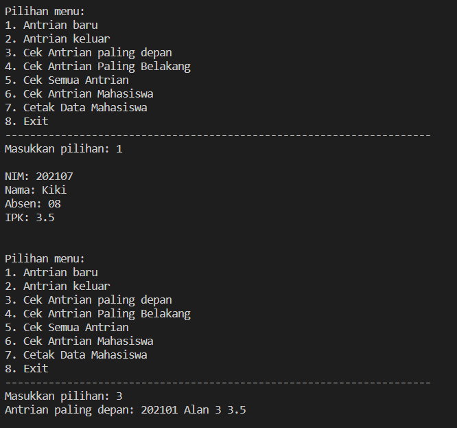

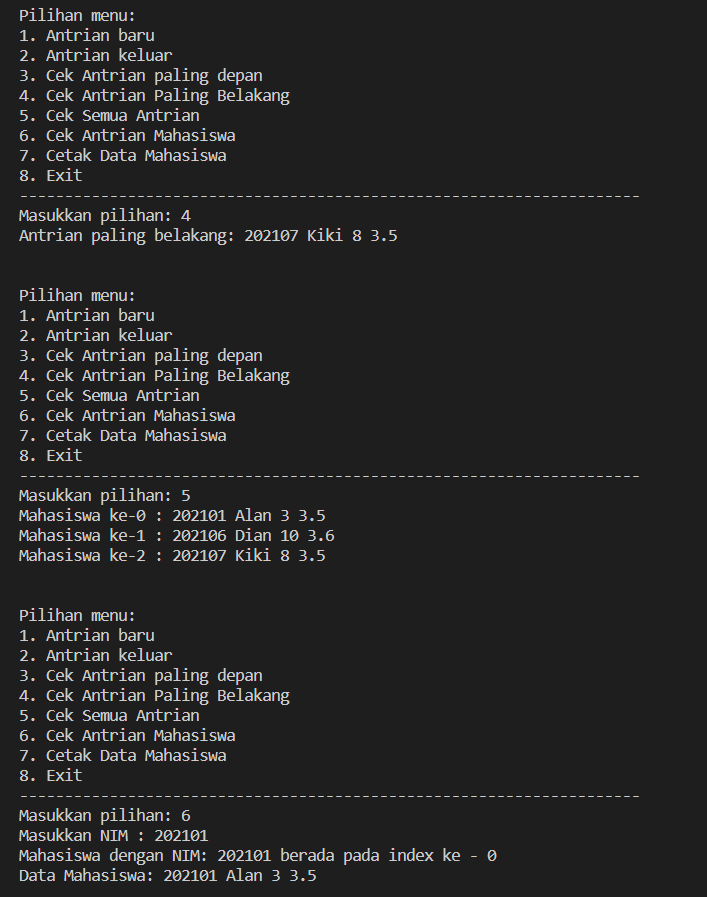

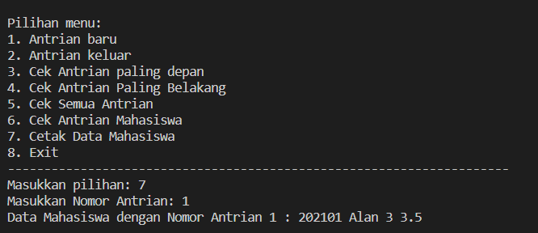

Implementasikan Queue pada antrian mahasiswa dengan menggunakan konsep LinkedList! 

- Code:

```
package Tugas;

public class implementasiLLQueue {
    String nim, nama;
    int absen;
    double ipk;
    implementasiLLQueue next;
    
    implementasiLLQueue(String nim, String nama, int absen, double ipk, implementasiLLQueue next){
        this.nim = nim;
        this.nama = nama;
        this.absen = absen;
        this.ipk = ipk;
        this.next = next;
    }
}

public class SLLQueueT4 {
    implementasiLLQueue head;
    implementasiLLQueue tail;

    public boolean IsEmpty(){
        return head == null;
    }

    public void print(){
        if(!IsEmpty()){
            implementasiLLQueue tmp = head;
            int sort = 0;
            while(tmp != null){
                System.out.println("Mahasiswa ke-" + sort + " : " + tmp.nim + " " + 
                tmp.nama + " " + tmp.absen + " " + tmp.ipk);
                tmp = tmp.next;
                sort++;
            }
        }else{
            System.out.println("Antrian Masih Kosong!");
        }
    }

    public void peek(){
        if(!IsEmpty()){
            implementasiLLQueue tmp = head;
            System.out.println("Antrian paling depan: " + tmp.nim + " " + 
            tmp.nama + " " + tmp.absen + " " + tmp.ipk);
        }else{
            System.out.println("Antrian masing kosong!");
        }
    }

    public void peekRear(){
        if(!IsEmpty()){
            implementasiLLQueue tmp = head;
            while(tmp != null){
                if(tmp == tail){
                    System.out.println("Antrian paling belakang: " + tmp.nim + " " + 
                    tmp.nama + " " + tmp.absen + " " + tmp.ipk);
                }
                tmp = tmp.next;
            }
        }else{
            System.out.println("Antrian masih kosong!");
        }
    }

    public void Enqueue(String nim, String nama, int absen, double ipk){
        implementasiLLQueue ndInput = new implementasiLLQueue(nim, nama, absen, ipk, null);
        if(IsEmpty()){
            head = ndInput;
            tail = ndInput;
        }else{
            tail.next = ndInput;
            tail = ndInput;
        }
    }

    public void Dequeue(){
        if(IsEmpty()){
            System.out.println("Antrian Masih Kosong, tidak dapat dihapus!");
        }else if (head == tail){
            head = tail = null;
        }else{
            implementasiLLQueue temp = head;
            while(temp.next != tail){
                temp = temp.next;
            }
            temp.next = null;
            tail = temp;
        }
    }


    public void peekPosition(String key){
        implementasiLLQueue tmp = head;
        int index = 0;
        while (tmp != null && (!(tmp.nim.equals(key)))){
            tmp = tmp.next;
            index++;
        }
        if(tmp == null){
            System.out.println("Antrian Kosong!");
        }else{
            System.out.println("Mahasiswa dengan NIM: " + key + " berada pada index ke - " + index);
        }
        System.out.println("Data Mahasiswa: " + tmp.nim + " " + 
        tmp.nama + " " + tmp.absen + " " + tmp.ipk);
    }

    public void peekAt(int index){
        if(IsEmpty()){
            System.out.println("Antrian masih kosong!");
        }else{
            implementasiLLQueue tmp = head;
            for(int i=1; i<index; i++){
                tmp = tmp.next;
            }
            System.out.println("Data Mahasiswa dengan Nomor Antrian " + index + " : " + tmp.nim + " " + 
            tmp.nama + " " + tmp.absen + " " + tmp.ipk);
        }
    }

    public void clear(int jml){
        if(!IsEmpty()){
            head = tail = null;
            jml = 0;
            System.out.println("Antrian Mahasiswa berhasil dikosongkan");
        }else{
            System.out.println("Antrian Mahasiswa Masih kosong");
        }
    }
}

import java.util.Scanner;
public class implementasiLinkedListQueue {
    String nim, nama;
    int absen;
    double ipk;
    implementasiLinkedListQueue next;
    
    implementasiLinkedListQueue(String nim, String nama, int absen, double ipk, implementasiLinkedListQueue next){
        this.nim = nim;
        this.nama = nama;
        this.absen = absen;
        this.ipk = ipk;
        this.next = next;
    }
}


class SLLQueue{
    implementasiLinkedListQueue head;
    implementasiLinkedListQueue tail;

    public boolean IsEmpty(){
        return head == null;
    }

    public void print(){
        if(!IsEmpty()){
            implementasiLinkedListQueue tmp = head;
            int sort = 0;
            while(tmp != null){
                System.out.println("Mahasiswa ke-" + sort + " : " + tmp.nim + " " + 
                tmp.nama + " " + tmp.absen + " " + tmp.ipk);
                tmp = tmp.next;
                sort++;
            }
        }else{
            System.out.println("Antrian Masih Kosong!");
        }
    }

    public void peek(){
        if(!IsEmpty()){
            implementasiLinkedListQueue tmp = head;
            System.out.println("Antrian paling depan: " + tmp.nim + " " + 
            tmp.nama + " " + tmp.absen + " " + tmp.ipk);
        }else{
            System.out.println("Antrian masing kosong!");
        }
    }

    public void peekRear(){
        if(!IsEmpty()){
            implementasiLinkedListQueue tmp = head;
            while(tmp != null){
                if(tmp == tail){
                    System.out.println("Antrian paling belakang: " + tmp.nim + " " + 
                    tmp.nama + " " + tmp.absen + " " + tmp.ipk);
                }
                tmp = tmp.next;
            }
        }else{
            System.out.println("Antrian masih kosong!");
        }
    }

    public void Enqueue(String nim, String nama, int absen, double ipk){
        implementasiLinkedListQueue ndInput = new implementasiLinkedListQueue(nim, nama, absen, ipk, null);
        if(IsEmpty()){
            head = ndInput;
            tail = ndInput;
        }else{
            tail.next = ndInput;
            tail = ndInput;
        }
    }

    public void Dequeue(){
        if(IsEmpty()){
            System.out.println("Antrian Masih Kosong, tidak dapat dihapus!");
        }else if (head == tail){
            head = tail = null;
        }else{
            implementasiLinkedListQueue temp = head;
            while(temp.next != tail){
                temp = temp.next;
            }
            temp.next = null;
            tail = temp;
        }
    }


    public void peekPosition(String key){
        implementasiLinkedListQueue tmp = head;
        int index = 0;
        while (tmp != null && (!(tmp.nim.equals(key)))){
            tmp = tmp.next;
            index++;
        }
        if(tmp == null){
            System.out.println("Antrian Kosong!");
        }else{
            System.out.println("Mahasiswa dengan NIM: " + key + " berada pada index ke - " + index);
        }
        System.out.println("Data Mahasiswa: " + tmp.nim + " " + 
        tmp.nama + " " + tmp.absen + " " + tmp.ipk);
    }

    public void peekAt(int index){
        if(IsEmpty()){
            System.out.println("Antrian masih kosong!");
        }else{
            implementasiLinkedListQueue tmp = head;
            for(int i=1; i<index; i++){
                tmp = tmp.next;
            }
            System.out.println("Data Mahasiswa dengan Nomor Antrian " + index + " : " + tmp.nim + " " + 
            tmp.nama + " " + tmp.absen + " " + tmp.ipk);
        }
    }

    public void clear(int jml){
        if(!IsEmpty()){
            head = tail = null;
            jml = 0;
            System.out.println("Antrian Mahasiswa berhasil dikosongkan");
        }else{
            System.out.println("Antrian Mahasiswa Masih kosong");
        }
    }
}

class implementasiLinkedListQueueMain{
    public static void menu(){
        System.out.println("\nPilihan menu: ");
        System.out.println("1. Antrian baru (Enqueue)");
        System.out.println("2. Antrian keluar (Dequeue)");
        System.out.println("3. Cek Antrian paling depan (Peek)");
        System.out.println("4. Cek Antrian Paling Belakang (Peek Rear)");
        System.out.println("5. Cek Semua Antrian");
        System.out.println("6. Cek Antrian Mahasiswa (Peek Position)");
        System.out.println("7. Cetak Data Mahasiswa (Peek At)");
        System.out.println("8. Kosongkan Antrian (Clear)");
        System.out.println("9. Exit");
        System.out.println("---------------------------------------------------------------------");
    }   

    public static void main(String[] args) {
        SLLQueue sllM = new SLLQueue();
        Scanner sc = new Scanner(System.in);
        Scanner input = new Scanner(System.in);

        int pilih, jml;

        System.out.println("Masukkan Jumlah Mahasiswa: ");
        jml = sc.nextInt();
        do{
            menu();
            System.out.print("Masukkan pilihan: ");
            pilih = sc.nextInt();
            sc.nextLine();
            switch(pilih){
                case 1:
                    System.out.print("\nNIM: ");
                    String nim = sc.nextLine();
                    System.out.print("Nama: ");
                    String nama = sc.nextLine();
                    System.out.print("Absen: ");
                    int absen = sc.nextInt();
                    System.out.print("IPK: ");
                    double ipk = sc.nextDouble();
                    sllM.Enqueue(nim, nama, absen, ipk);
                    System.out.println("");
                    break;
                case 2:
                    sllM.Dequeue();
                    System.out.println("");
                    break;
                case 3:
                    sllM.peek();
                    System.out.println("");
                    break;
                case 4:
                    sllM.peekRear();
                    System.out.println("");
                    break;
                case 5:
                    sllM.print();
                    System.out.println("");
                    break;
                case 6:
                    System.out.print("Masukkan NIM : ");
                    String cari = input.nextLine();
                    sllM.peekPosition(cari);
                    System.out.println("");
                    break;
                case 7:
                    System.out.print("Masukkan Nomor Antrian: ");
                    int index = sc.nextInt();
                    sllM.peekAt(index);
                    break;
                case 8:
                    sllM.clear(jml);
                    System.out.println("");
                    break;
                case 9:
                    System.out.println("TERIMA KASIH....");
                    System.exit(0);
                    break;
            }
        } while (pilih > 0 && pilih < 10);
        System.out.println("TERIMA KASIH...");
    }
}
```

- Output:

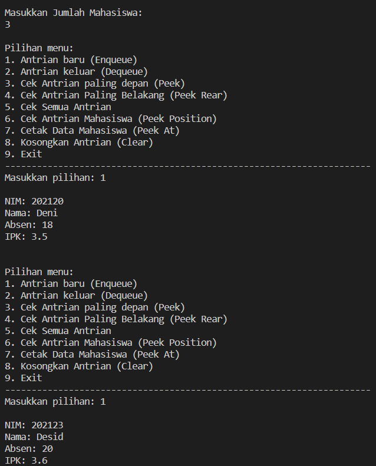


